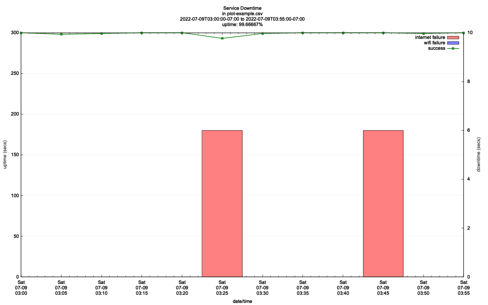

# moniconn - monitor internet connection access

This project helps you understand the reliability of your wireless and
internet connections. It contains two tools: `moniconn.sh` and
`plot-conn.gp`.

It was written because I was experiencing intermittent service failures
and wanted to keep track of them over time so that i could present
them to my ISP.

The `moniconn.sh` _bash_ script collects data about the internet and
gateway router connections (typically WiFi) and stores it in a CSV
(comma separated variable) format file.

The generated CSV data file can then be read by the `plot-conn.gp`
_gnuplot script_ to generate a simple plot that the shows the
downtimes.

The tools require _gnu date_, a recent version of _bash_ (5.x)
and a recent version of _gnuplot_ (5.x).

If you are interested in how i setup my mac please see the gist:
[How i setup my Mac for development](https://gist.github.com/jlinoff/adb0a9b886085d9f3a4719571cfad901)

This is an example of a plot that was generated from an hours worth of
data collection.



The bars at the bottom are the failures.

It is based on a run that was initiated like this: `make hour-now`.
To see more make targets type `make help`.

These tools you be used to monitor your interconnection
to see how reliable it is. The data can also be presented
to your internet service provider (ISP) to help track
down service problems.

### get an hourly report:

```bash
make hour
```

### get a daily report:

```bash
make day
```

### get a weekly report:

```bash
make weekly
```

### make help
```bash

=-=-=-=-=-=-=-=-=-=-=-=-=-=-=-=-=-=-=-=-=-=-=-=-=-=-=-=-=-=-=-=-=-=-=-=-=-=
=-=-= Target: help 
=-=-= Date: Wed Jul  6 07:38:17 PDT 2022 
=-=-= Directory: /Users/jlinoff/work/moniconn 
=-=-=-=-=-=-=-=-=-=-=-=-=-=-=-=-=-=-=-=-=-=-=-=-=-=-=-=-=-=-=-=-=-=-=-=-=-=

Targets
   day          Make a daily report for the next full day and display plot when done.
   help         this help message
   hour         Make an hourly report starting at the beginning of the next hour and display plot when done.
   hour-now     Make an hourly report starting now and display plot when done.
   interval     Make a custom interval report. Must set START and STOP times. Example: make interval START=13:00 STOP=17:00
   week         Make a weekly report starting the next full day and display plot when done.

```

### moniconn.sh environment variables
These environment variables control the behavior of moniconn.sh.
```
# Environment Variables
#   START=time    Start time, default: now.
#                 Set START='17:00' to start a 5:00pm
#                 Set START='23:59' to start a 11:59pm
#                 Set START='10 minutes' to start in 10 minutes.
#   STOP=cond     STOP condition. default: None (runs forever) or until ctrl-c is entered.
#                 Set STOP='1 minute' to stop after a minute.
#                 Set STOP='2 minutes' to stop after two minutes.
#                 Set STOP='1 day' to stop after a day.
#                 Set STOP='2 days' to stop after two days.
#                 Set STOP='1 week' to stop after a week.
#                 Set STOP='2 weeks' to stop after two weeks.
#   CSV=file      CSV data file, default: moniconn.csv.
#   CI=secs       capture interval, defauLt=300 (5min)
#   SI=secs       sample interval (must be factor of CI that is less than CI), default=5
#   PING=cmd      ping command. Default "ping -t 1 -c 1".
#   INTERNET_URL  the URL used to test internet connectivity, default www.google.com
#   WIFI_IP       the IP address used to test wifi connetivity, default is deduced using ifconfig.
#   VERBOSE=0     no output, all data is in the data (CSV) file.
#   VERBOSE=1     output only when a capture record is generated
#   VERBOSE=2     VERBOSE=1 + report connection errors
#   VERBOSE=3     VERBOSE=2 + sample status
```

### snapshots
You can type `ctrl-c` during a `moniconn.sh` run to see a snapshot of the progress and then continue.

You can view the intermediate results in the CSV file at any time.

### calculate seconds until midnight
This came up while analyzing another problem and i thought that it was worth saving.
```bash
echo $(( $(date -d $(date -d '+ 1 day' +'%FT00:00:00') +%s) - $(date +%s) ))
```
